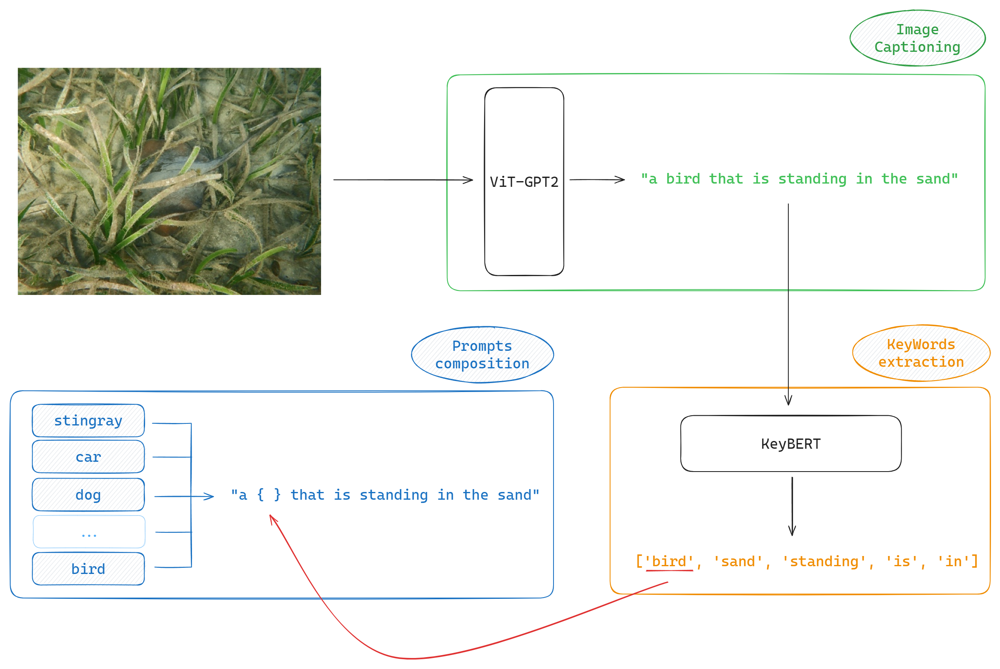

# Test Time Adaptation (TTA) project 

Test Time Adaptation (TTA) explores the possibility to improve a model's performaces working at test time instead of fine tuning it in a "traditional" way. That can be a really effective and helpfull practice mostly for 2 reasons:
1) 💥 Fine tuning itself might be not so straight forward. It really depends on the architecture, but it can be challenging.
2) 💸 Big models require non neglectable computational capacity & data to work with. **(Lots of money)**.

Our obective is to implement a TTA solution to improve an existent image classifier.

 

## Design
The backbone model of choice is [**Contrastive Language–Image Pre-training (CLIP)**](https://openai.com/index/clip/), a well known model by OpenAI trained with the contrastive learning paradigma, capable of making zero-shot classification.

 

A possible TTA solution for CLIP as [**Test-Time Prompt Tuning (TPT)**](https://arxiv.org/abs/2209.07511)

 

 

What TPT does is basically:
* Consider one image at time and augment it N times.
* Push the augmented images and the original one togheter with a set of prompts through the CLIP image and text encoders.
* Compute the entropy of all augmentations + the original and keep the best 10% (minimizing the entropy).
* Average the top 10% distributions obtaining a marginal distribution, so compute again the (marginal) entropy.
Prompts can be either handcrafted ("a photo of a {label}" or whatever) or learned via promp learner such as [**CoOp**](https://arxiv.org/abs/2109.01134). Adding a prompt learner also adds the possibility to actually use the computed marginal entropy as our model's loss function.

 

## Our Contribution

For the most part we focussed on finding better alternatives to the image augmentation methods proposed in TPT :

### Image Augmentations
1) **PreAugment**
2) [**AugMix**](https://arxiv.org/abs/1912.02781) 
3) [**AutoAugment**](https://arxiv.org/abs/1805.09501)
4) **DiffusionAugment**
**N.B.** $\rightarrow$ implementation matters! (notebook)[notebook.ipynb]

 

Testing on ImageNet-A we scored :

| Augmentation Technique | Avg Accuracy (%)             |
| ---------------------- | ---------------------------- |
| PreAugment             | 27.51                        |
| AugMix                 | 28.80                        |
| **AutoAugment**        | **30.36**                    |
| DiffusionAugment       | _(notebook)[notebook.ipynb]_ |

### Prompt Augmentation

We introduce a our approach for augmenting prompts using an **image captioning system**. 

This method aims to create more context-aware prompts compared to the standard, generic descriptions like "a photo of a {label}" Our hypothesis is that captions specifically tailored to the content of the image will enhance the alignment between the image and the class labels, leading to improved model performance.

 

 

**Accuracy on CLIP (CLIP-RN50):**

| Method                | Avg Loss      | Avg Accuracy (%) |
| --------------------- | ------------- | ---------------- |
| Our Method            | 3.0781        | 19.41            |
| Baseline              | -             | 21.83            |

**Accuracy on CLIP (CLIP-ViT-B/16):**

| Method                | Avg Loss      | Avg Accuracy (%) |
| --------------------- | ------------- | ---------------- |
| Our Method            | 2.5711        | 42.13            |
| Baseline              | -             | 47.87            |

Results are a bit underwhelming, but there's much room for improvement! read the (notebook)[notebook.ipynb] for a better insight on our methodology.

---

contributors : [@LuCazzola](https://github.com/LuCazzola) [@lorenzialessandro](https://github.com/lorenzialessandro)

