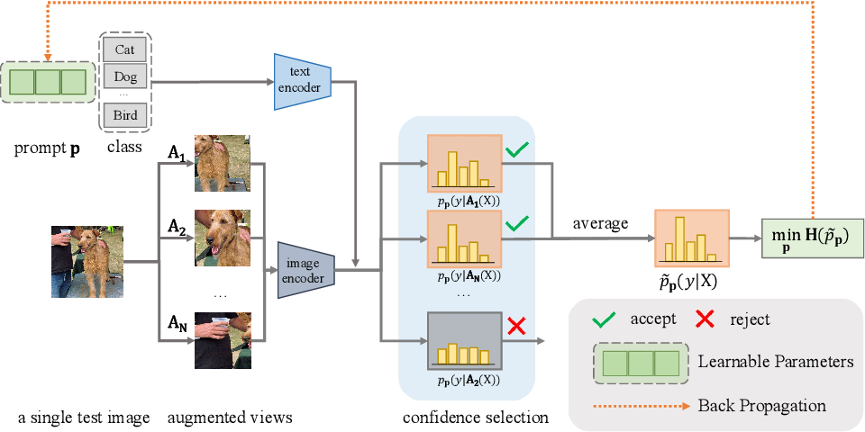

# Test Time Adaptation (TTA) project 

Test Time Adaptation (TTA) explores the possibility to improve a model's performaces working at test time instead of fine tuning it in a "traditional" way. That can be a really effective and helpfull practice mostly for 2 reasons:
1) 💥 Fine tuning itself might be not so straight forward. It really depends on the architecture, but it can be challenging.
2) 💸 Big models require non neglectable computational capacity & data to work with. **(Lots of money)**.

Our obective is to implement a TTA solution to improve an existent image classifier.

## Design
The backbone model of choice is [Contrastive Language–Image Pre-training (CLIP)](https://openai.com/index/clip/), a well known model by OpenAI trained with the contrastive learning paradigma, capable of making zero-shot classification.

 

A possible TTA solution for CLIP as [Test-Time Prompt Tuning (TPT)](https://arxiv.org/abs/2209.07511)

What TPT does is basically:
* Consider one image at time and augment it N times.
* Push the augmented images and the original one through the CLIP image encoder togheter with a set of prompts.
* Compute the entropy of all augmentations + the original and keep the best 10% (minimizing the entropy).
* Average the top 10% distributions obtaining a marginal distribution, so compute again the (marginal) entropy.
Prompts can be either handcrafted ("a photo of a {label}" or whatever) or learned via promp learner such as CoOp. Adding a prompt learner also adds the possibility to actually use the computed marginal entropy as our model's loss function.
